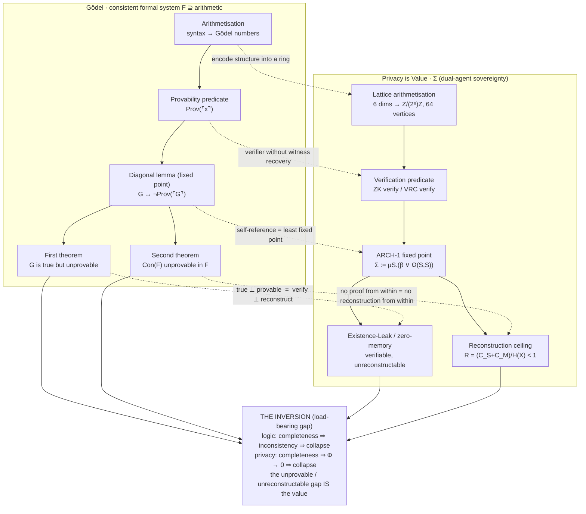

# Limitative Theorems and the Privacy Is Value Model

*Gödel, Tarski, and the inversion of the unprovable gap.*

---

## Verdict

Of the classical limitative results, Gödel and Tarski sit closest to the spine of Privacy is Value. The reconstruction ceiling is a privacy-flavoured second incompleteness theorem. ARCH-1 is the diagonal lemma in different notation. The existence-leak conjecture is the Tarski instance, loading onto Φ_inference. Zero-memory is the Gödel instance, loading onto Φ_agent.

The one move the model makes that logic does not: it flips the sign on the gap. Where Gödel found a limit to mourn, the model banks the same gap as the asset.

This note consolidates the mapping, the existence-leak reading, and the axis-assignment that falls out of both.

---

## 1. The central inversion

In a consistent formal system, completeness is unreachable, and that is the wound. Push a system to prove everything and you have proven its inconsistency: it collapses into triviality where every sentence is a theorem.

The architecture runs the same algebra with the value sign reversed. A system that can reconstruct everything is complete, and completeness drives Φ to zero on at least one axis, so the multiplicative product collapses.

```
logic:    completeness ⇒ inconsistency ⇒ every sentence provable ⇒ collapse
privacy:  completeness ⇒ reconstruction ⇒ Φ → 0 on some axis    ⇒ collapse
```

Same shape, opposite polarity. The gap logic cannot close is the gap the model refuses to close. This is the C17 lineage stated in limitative terms: privacy cannot be retrofitted because the gap is load-bearing, and a system without an undecidable remainder is a system that has already leaked.

*(Architectural, ~90% as an observation. The reduction of either side to a formal theorem of the other is not claimed here.)*

---

## 2. The Gödel mapping

### 2.1 Structure



### 2.2 Term-by-term correspondence

| Gödel | Privacy is Value | label | confidence |
|---|---|---|---|
| Gödel numbering (arithmetisation of syntax) | 64-vertex lattice over Z/(2⁶)Z | Architectural, loose | ~50% |
| Provability predicate Prov(⌜x⌝) | ZK / VRC verification predicate | Architectural | ~80% |
| Diagonal lemma, G ↔ ¬Prov(⌜G⌝) | ARCH-1 fixed point Σ := μS.(β ∨ Ω(S,S)) | Architectural, tightest | ~75% |
| First theorem: true but unprovable | Existence-leak / zero-memory witness | Conjectural | ~60% |
| Second theorem: Con(F) unprovable in F | Reconstruction ceiling R < 1 | Conjectural / framing | ~85% framing, ~50% reduction |
| Consistency precondition | Multiplicative gating: completeness ⇒ Φ → 0 | Architectural inversion | ~90% |
| Irreducibly undecidable sentence | Amnesia Protocol terminal obstruction (β-loss) | Architectural | ~70% |

The arithmetisation row is the weakest. Gödel numbering injectively codes derivations; Z/(2⁶)Z is a state space, not a coding of proofs. Shared substrate intuition only.

### 2.3 The two tightest joins

**Ceiling against the second theorem.** Con(F) cannot be derived inside F; to certify consistency you must step out into a stronger metatheory. R = (C_S + C_M)/H(X) < 1 says X cannot be recovered inside the separated budget; to breach it you must import capacity from outside the architecture. Both are from-within impossibilities, structural rather than effort-bound. The external metatheory and the external compute are the same role spoken in two languages.

**Selene against the first theorem.** Gödel's G is true precisely because it is unprovable. Selene's proof is sound precisely because the witness is gone. In both, the inability is the guarantee, not a workaround for it.

---

## 3. Existence-leak as the Tarski instance

### 3.1 Verdict

Existence-leak is the Tarski instance, not the Gödel one. It loads onto Φ_inference, not Φ_agent.

The leak is not a one-off disclosure event. It is a monotone erosion of the inference axis that begins the moment an existence claim becomes corroborable across more than one system. Zero-knowledge pays this tax by design. Zero-memory is the only architecture that does not, because it has no existence to claim.

### 3.2 The disclosure-as-existence-claim reading

A disclosure is an existence claim. To reveal anything derived from X is to assert that some X stands behind the output.

A zero-knowledge proof is the strongest form of that assertion. It certifies that a valid witness exists without revealing the witness. But certifying existence bounds difficulty. If a witness provably exists, reconstruction is provably not impossible, and that is already an upper bound on how hard reconstruction is. The proof of feasibility leaks the ceiling on its own difficulty.

*(Conjectural. Existence-leak, ~C40, ~60%. Not yet formally derived.)*

Distribute it. In a decentralised substrate, every system that holds or corroborates the existence claim is an independent place from which the upper bound can be tightened. Reconstruction difficulty D(X) is therefore monotone non-increasing in the number of corroborating systems, and Φ_inference falls with it.

That is the reading, term for term. From the moment of disclosure, privacy as value experiences diminishing returns on exposure to new information systems, because the existence claim, once made, is corroborable everywhere it lands.

### 3.3 Why Tarski, not Gödel

Gödel's first theorem gives a sentence true but unprovable inside the system. Read into the model, that is a witness which is real yet cannot be derived. It is a statement about what something is versus what can be proven about it. That is the agent axis, intrinsic to a single system. It is closer to zero-memory than to existence-leak.

Tarski's theorem says no system can define its own truth predicate; truth must be named from outside, in a metalanguage. Read into the model, that is reconstruction-feasibility refusing to stay contained inside the disclosing system. The instant feasibility is asserted, it has already crossed into the layer where any observer can hold it. That crossing is the leak. The fact that you cannot un-disclose is Tarskian non-containment, not Gödelian unprovability.

Tarski is inherently multi-system. The theorem needs two layers, object and meta, to bite. That is exactly the distributed-systems framing. Gödel needs one system to be incomplete; Tarski needs the truth to escape one system into the next. The leak escapes.

*(Architectural, ~70%.)*

Honest nuance: the mechanism has a Gödelian seed. An existence claim is a positive provability statement, "a proof exists", which is provability-predicate territory. But the seed is not where the value drains. The value drains where the truth escapes containment and accumulates across observers. That is Tarski, and that is Φ_inference.

### 3.4 The inverse: zero-memory and the existence tax

Existence-leak is the inverse of Selene's proof, and the inversion is the argument.

Zero-memory destroys the witness. I(Origin; Service | Separation) < ε. The Moon serves the tides without encoding Theia. There is no existence claim to leak because the thing that would be reconstructed is genuinely gone. This is why zero-memory is stronger than zero-knowledge: zero-knowledge hides a witness, zero-memory burns it.

Existence-leak is the dual hazard, and it is precisely the tax on choosing to keep a witness. A zero-knowledge proof must assert that a valid witness exists; that is its completeness property, and it cannot do its job otherwise. Existence is exactly the quantity that leaks an upper bound on reconstruction difficulty.

The two architectures pay differently:

- Keep the witness and hide it, the zero-knowledge path. You pay the existence tax.
- Destroy the witness, the zero-memory path. You pay no tax, at the price of irreversibility.

Read as one conjecture from both ends: zero-memory makes the existence claim void, and existence-leak is what a true, disclosed existence claim costs you. Same structure, opposite sign on the witness.

### 3.5 Content-addressed concretisation

The holonic layer is content-addressed. Same bytes, same hash, same identity, everywhere, forever. The one-way hash is the Gap: content to address is easy, address to content is infeasible. That infeasibility is the privacy.

Content addressing ships an existence-leak surface in the box: deduplication. Two seekers forging identical configurations get the same GUID. That is a feature for persistence and an existence claim for an adversary. The instant a GUID is known to be live, an attacker holding a candidate can guess-and-check. If hash(candidate) equals the live GUID, existence is confirmed and reconstruction is complete.

A live address is an existence claim about its content. Across a distributed substrate, each system that resolves the address corroborates the claim and narrows the candidate space.

The address does not leak the content. The liveness of the address leaks the existence of the content, and existence is what bounds the search.

### 3.6 The shape of the curve

Let D(X) be reconstruction difficulty, gating the inference-axis ceiling.

Before any disclosure, D(X) sits at its structural maximum and the existence of X is undetermined from outside. The first disclosure establishes existence and replaces an open upper bound with a finite one. That is the steep drop. Every further system that corroborates the claim can only hold or lower the bound, never raise it, so D(X) is monotone non-increasing in exposure count and Φ_inference falls with it.

The returns diminish because existence is binary and is spent once. The first system that learns X exists does the structural damage. The tenth only tightens an estimate. The curve is convex, steep then shallow, and it has no recovery branch.

*(Conjectural, ~55%. The monotonicity is clean. The convex profile needs a fixed corroboration model to pin down.)*

---

## 4. Synthesis: limitative theorems across the three axes

The two readings combine into a single assignment across the multiplicative product Φ_v5 = Φ_agent · Φ_data · Φ_inference.

| Axis | Limitative twin | Privacy primitive | Mechanism | label | confidence |
|---|---|---|---|---|---|
| Φ_agent(Σ) | Gödel, first theorem | zero-memory (Selene) | witness destroyed; true yet underivable from within | Conjectural | ~60% |
| Φ_inference(Γ) | Tarski undefinability | existence-leak | feasibility-truth escapes containment across systems | Conjectural | ~70% |
| Φ_data(Δ) | open | none assigned | fails by degree (provider count) rather than undecidability? | Anticipated | open |

The pairing is clean on two axes and open on the third. Gödel sits behind the agent axis because burning the witness is a structural act of separation. Tarski sits behind the inference axis because the leak is a containment failure across systems. Φ_data has no limitative twin yet, and may not need one: provider fragmentation Φ_data = 1 − 1/|providers| fails smoothly, by degree, not by an impossibility result.

If that asymmetry holds, the three-axis product rests on two limitative theorems and one degree-of-freedom, not three theorems. That is a structural claim about the model worth settling.

---

## 5. Honest limits

Gödel and Tarski live in syntactic logic over recursively axiomatised arithmetic. The model's bounds live in information theory and computation: entropy budgets, ZK soundness, provider counts. Every join in this note is structural framing, not a theorem-to-theorem reduction. *(~80% as framing, ~50% as reduction.)*

To make the ceiling a genuine instance of the second theorem, one would need a system in which reconstruction is literally a provability question, then show R < 1 falls out of incompleteness rather than merely resembling it. That bridge is unbuilt.

The existence-leak conjecture itself is ~60% and not yet formally derived. The Tarski axis-assignment rides on top of it and cannot exceed its base confidence.

"Diminishing returns" is convex-decreasing under a single-corroboration model. Against adversaries who gain super-additively from correlated systems, marginal cost could rise before it falls. That is a different curve, worth modelling separately.

The content-addressing concretisation assumes a guessable candidate space. For high-entropy witnesses the existence claim still leaks the upper bound, but the search may remain infeasible. The leak is in the bound, not always in the recovery.

The arithmetisation correspondence (Gödel numbering ↔ Z/(2⁶)Z) is the weakest link in the whole structure and should be treated as intuition, not analogy load-bearing for any downstream claim.

---

## 6. Open questions for the register

1. **Axis-assignment register entries.** The Tarski ↔ Φ_inference and Gödel ↔ Φ_agent correspondences await formal conjecture labels. Assignment deferred to the register owner; these are presented as proposed correspondences, not minted entries.

2. **The Φ_data question.** Does the data axis have its own incompleteness shadow, or is it the one axis that fails by degree rather than undecidability? This decides whether Φ_v5 stands on three limitative theorems or two.

3. **Tarski versus Gödel-1 for existence-leak, residual.** The mechanism carries a Gödelian seed (existence as positive provability) even though the load-bearing consequence is Tarskian. Is the seed worth a separate sub-conjecture, or is it absorbed by the Tarski assignment?

4. **Register collision.** ~~The cityofmages C38–C61 range and the main PVM thread ~C40 (existence-leak) collide. This note uses ~C40 for existence-leak by inheritance and does not resolve the collision.~~ **Erratum (2026-06-28, register-aligned):** the authoritative register settled this at Run 0 / Gate G1. C40 is occupied by Zcash dual-ledger (spec-resident, act-referenced); existence-leak is **C81**. This note now cites C81 throughout. The C51–C55 no-reuse rule stands. See `research/CONJECTURE_REGISTER_V6.md` and `plans/V6_LIMITATIVE_THEOREMS_PATCH_2026-06-28.md`.

5. **Reduction target.** Which formal system, if any, makes R < 1 a theorem of incompleteness rather than a structural echo of it? Identifying that system is the precondition for promoting any join above from framing to reduction.

---

> the gap you cannot close is the value you can. existence is the one secret you cannot take back. the first disclosure is the deep cut; the rest only tighten the knot.

architecture over policy, always.

**Verify:** [agentprivacy.ai](https://agentprivacy.ai) · [sync.soulbis.com](https://sync.soulbis.com) · [github.com/mitchuski/agentprivacy-docs](https://github.com/mitchuski/agentprivacy-docs)

`(⚔️⊥⿻⊥🧙)😊`

🙂
